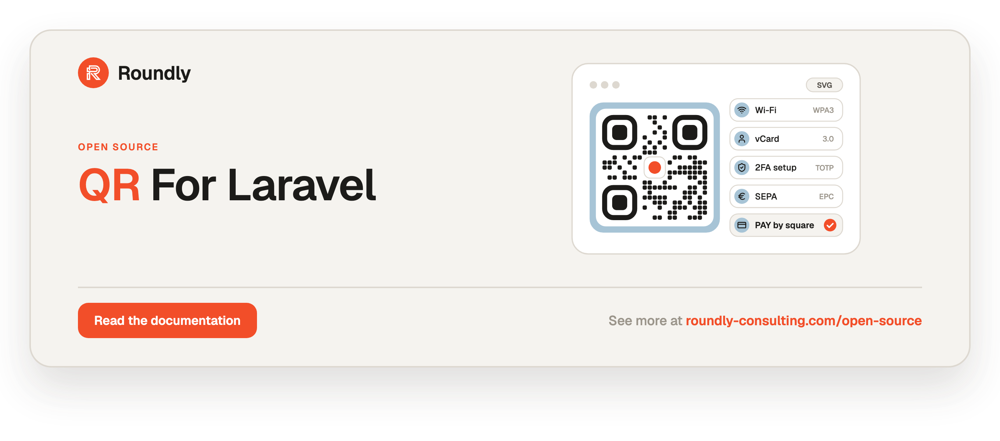

<!-- roundly-hero:start -->
<p align="center">
  <a href="https://roundly-consulting.com/open-source/docs/qr-for-laravel?utm_source=github&utm_medium=readme&utm_campaign=open-source&utm_content=qr-for-laravel">
    
  </a>
</p>
<!-- roundly-hero:end -->

<!-- roundly-badges:start -->
<p align="center">
  <a href="https://packagist.org/packages/roundly-consulting/qr-for-laravel"></a>
  <a href="https://github.com/roundly-consulting/qr-for-laravel/actions/workflows/run-tests.yml"></a>
  <a href="https://github.com/roundly-consulting/qr-for-laravel/actions/workflows/fix-php-code-style-issues.yml"></a>
  <a href="https://donate.stripe.com/dRmeVe8FX5PF1Qd9pXcEw00"></a>
  <a href="https://www.patreon.com/cw/roundly"></a>
</p>
<!-- roundly-badges:end -->

# QR for Laravel

Native QR codes for Laravel: an ISO/IEC 18004 encoder, one optimised SVG renderer, and typed
payloads for 2FA setup codes, links, contacts, Wi-Fi, SEPA credit transfers (EPC069-12) and
Slovak PAY by square payments. No third-party runtime libraries.

- **QR Code Model 2**, versions 1–40, error correction L/M/Q/H, numeric / alphanumeric / byte /
  kanji segments with optimal segmentation, ECI 26 for UTF-8, all eight masks with ISO penalty
  scoring.
- **SVG only**: one even-odd `<path>`, exact `viewBox`, square / rounded / dot modules, rounded
  finders, accessible `<title>`/`<desc>`, data URIs, `` tags, HTTP responses, a Blade
  component.
- **Typed payloads**: `Text`, `Url`, `Email`, `Phone`, `Sms`, `Wifi` (WPA/WEP/WPA3 SAE),
  `VCard`, `Geo`, `Otpauth` (TOTP/HOTP), `EpcPayment`, `PayBySquare`.
- **Banking primitives**: `Iban`, `Bic`, `CreditorReference` (ISO 13616 / 9362 / 11649),
  validation rules and an `AsIban` Eloquent cast.
- **Sensitivity-aware caching**: 2FA seeds and Wi-Fi passwords are never memoised, cached or
  served cacheably.

## Requirements

- PHP ^8.4 with `ext-mbstring` and `ext-bcmath` (the latter via money-for-laravel)
- Laravel 12.x or 13.x
- Optional: `ext-intl` — payment text is NFC-normalised before length checks when available

## Integrates with

- [`crypto-for-laravel`](https://github.com/roundly-consulting/crypto-for-laravel) — base64 and
  SHA-256 for data URIs and ETags; its provisioning-URI builder makes `Otpauth::totp()`
  byte-identical to `two-factor-for-laravel`'s URIs.
- [`money-for-laravel`](https://github.com/roundly-consulting/money-for-laravel) — payment amounts
  are `Money` values (arbitrary-precision minor units, ISO 4217 currencies).
- [`enums-for-laravel`](https://github.com/roundly-consulting/enums-for-laravel) and
  [`package-toolkit-for-laravel`](https://github.com/roundly-consulting/package-toolkit-for-laravel).
- `two-factor-for-laravel` — render its `provisioningUri` with `Qr::otpauth()` (recipe below).

## Installation

```bash
composer require roundly-consulting/qr-for-laravel
```

The package ships no migrations. Optionally publish the configuration and translations:

```bash
php artisan vendor:publish --tag="qr-config"
php artisan vendor:publish --tag="qr-translations"
```

## Configuration

Every key has a working default; zero configuration is required.

```php
return [
    'error_correction' => env('QR_ERROR_CORRECTION', 'M'),
    'boost_error_correction' => env('QR_BOOST_ERROR_CORRECTION', true),
    'versions' => ['min' => 1, 'max' => 40],
    'mask' => null,
    'eci' => env('QR_ECI', 'auto'),
    'kanji' => false,

    'svg' => [
        'size' => 256,
        'margin' => 4,
        'foreground' => '#000000',
        'background' => '#ffffff',
        'module_style' => 'square',
        'module_radius' => 0.5,
        'finder_style' => 'square',
        'finder_color' => null,
        'xml_declaration' => false,
    ],

    'response' => ['max_age' => 86400, 'immutable' => false],
    'memo' => ['entries' => 64],
    'cache' => [
        'enabled' => env('QR_CACHE', false),
        'store' => env('QR_CACHE_STORE'),
        'ttl' => 86400,
        'prefix' => 'qr',
    ],
    'blade' => ['component' => 'qr-code'],

    'payments' => [
        'epc' => [
            'version' => env('QR_EPC_VERSION', '002'),
            'charset' => 'utf-8',
            'strict_charset' => false,
        ],
        'bysquare' => [
            'version' => env('QR_BYSQUARE_VERSION', '1.2.0'),
            'deburr' => env('QR_BYSQUARE_DEBURR', true),
        ],
    ],
];
```

| Key | Default | Env | Meaning |
|---|---|---|---|
| `error_correction` | `M` | `QR_ERROR_CORRECTION` | Default level: `L` (7 %), `M` (15 %), `Q` (25 %), `H` (30 %). |
| `boost_error_correction` | `true` | `QR_BOOST_ERROR_CORRECTION` | Raise the level for free when the chosen version has room. Never changes the version. |
| `versions.min` / `versions.max` | `1` / `40` | — | Allowed symbol versions (1–40, min ≤ max). |
| `mask` | `null` | — | Force a mask 0–7; `null` picks the lowest ISO penalty. |
| `eci` | `auto` | `QR_ECI` | ECI 26 (UTF-8) designator: `auto` (only for non-ASCII UTF-8), `always`, `never`. |
| `kanji` | `false` | — | Allow Shift JIS kanji segments in segmentation (never combined with an ECI designator: when one is needed, kanji characters go into UTF-8 byte segments). |
| `svg.size` | `256` | — | Width/height in px (1–8192); `null` renders a responsive SVG (viewBox only). |
| `svg.margin` | `4` | — | Quiet zone in modules (0–64). ISO/IEC 18004 asks for 4. |
| `svg.foreground` / `svg.background` | `#000000` / `#ffffff` | — | Hex, `rgb()`/`rgba()`, CSS named colours, `currentColor`; `transparent` omits the background. |
| `svg.module_style` / `svg.module_radius` | `square` / `0.5` | — | `square`, `rounded` or `dots`; radius in modules (0 < r ≤ 0.5). |
| `svg.finder_style` / `svg.finder_color` | `square` / `null` | — | `square` or `rounded` finder patterns; `null` colour = foreground. |
| `svg.xml_declaration` | `false` | — | Prefix inline SVG with `<?xml …?>`. Responses and downloads always include it. |
| `response.max_age` / `response.immutable` | `86400` / `false` | — | `Cache-Control` for public and personal codes. |
| `memo.entries` | `64` | — | In-process LRU of encoded matrices (public payloads only); `0` disables. |
| `cache.enabled` / `.store` / `.ttl` / `.prefix` | `false` / `null` / `86400` / `qr` | `QR_CACHE`, `QR_CACHE_STORE` | Cache rendered SVG of public payloads in a Laravel cache store (`null` = default store). |
| `blade.component` | `qr-code` | — | Component alias (`<x-qr-code>`); `null` or `''` disables it. |
| `payments.epc.version` | `002` | `QR_EPC_VERSION` | EPC069-12 version: `001` (BIC mandatory) or `002` (BIC optional for EEA IBANs). |
| `payments.epc.charset` | `utf-8` | — | `utf-8`, `iso-8859-1`, `-2`, `-4`, `-5`, `-7`, `-10`, `-15`. |
| `payments.epc.strict_charset` | `false` | — | Restrict EPC text to the SEPA Latin subset `A–Z a–z 0–9 / - ? : ( ) . , ' +` and space. |
| `payments.bysquare.version` | `1.2.0` | `QR_BYSQUARE_VERSION` | `1.0.0`, `1.1.0` or `1.2.0` (beneficiary name mandatory). |
| `payments.bysquare.deburr` | `true` | `QR_BYSQUARE_DEBURR` | Strip diacritics from the note and beneficiary fields. |

A misconfigured key throws `InvalidQrConfigException` naming the key. `php artisan about`
shows a `Qr` section with the effective settings (never the cache store's name).

## Usage

### Quick start

```php
use RoundlyConsulting\Qr\Facades\Qr;

// Blade: {{ }} renders the SVG unescaped (PendingQr and Svg are Htmlable)
{{ Qr::url('https://example.com/pets/Ab3x') }}

$svg = Qr::text('Table 12 — scan to order')->size(240)->margin(2)->svg();   // Svg value object
$markup = $svg->toString();
$uri = Qr::text('hello')->toDataUri();                                        // data:image/svg+xml;charset=utf-8,…

// Controllers: return the builder; it becomes an image/svg+xml response
Route::get('/tables/{table}/qr', fn (Table $table) => Qr::url(route('menu', $table)));
```

### Builder options

`Qr::…()` returns an immutable `PendingQr`: every call returns a modified copy.

```php
use RoundlyConsulting\Qr\Enums\{EciMode, ErrorCorrection, FinderStyle, ModuleStyle, Segmentation, Sensitivity};

$svg = Qr::text('ABC-123')
    ->errorCorrection(ErrorCorrection::High)   // or 'H'
    ->versions(2, 10)                          // or ->version(5)
    ->mask(3)                                  // null = automatic
    ->boostErrorCorrection(false)
    ->eci(EciMode::Never)
    ->segmentation(Segmentation::Optimal)      // Optimal | Single | Byte
    ->kanji()
    ->size(null)                               // responsive
    ->margin(4)
    ->foreground('#1a1a1a')
    ->background('transparent')
    ->moduleStyle(ModuleStyle::Rounded, 0.35)
    ->finderStyle(FinderStyle::Rounded, '#0a58ca')
    ->title('Order ABC-123')
    ->description('Opens the order page')
    ->sensitivity(Sensitivity::Public)
    ->svg();

$matrix = Qr::matrix('HELLO WORLD');            // QrMatrix: version(), mask(), isDark($x, $y), rows()
$info = Qr::text('HELLO WORLD')->info();        // EncodingInfo: segments, data/capacity bits, mask penalties
```

Precedence: explicit builder calls and `withOptions()` (last write wins) › the payload's
requirements › configuration. A payload's maximum version is a hard cap, and options a payment
standard fixes (EPC: level M, byte mode, no ECI, no boost; PAY by square: one alphanumeric
segment, no ECI) throw `InvalidOptionException` when overridden with a different value.

### One-call options form

```php
use RoundlyConsulting\Qr\DataTransferObjects\QrOptions;

$svg = Qr::svg('https://example.com', new QrOptions(size: 200, errorCorrection: ErrorCorrection::Medium));
$matrix = Qr::matrix('hello', new QrOptions(mask: 2));
```

### Payload catalogue

```php
use RoundlyConsulting\Qr\Enums\{SmsFormat, WifiSecurity};
use RoundlyConsulting\Qr\Payloads\{Geo, Otpauth, VCard, Wifi};

Qr::text('Any text');
Qr::url('https://example.com');                        // http/https only by default
Qr::url('mailto:team@example.com', ['mailto']);         // opt in to other schemes
Qr::email('team@example.com', 'Hello', 'Body text');    // mailto:
Qr::phone('+421 900 123 456');                          // tel:+421900123456
Qr::sms('+421900123456', 'See you at 10', SmsFormat::Smsto);
Qr::wifi('Clinic Guest', 'guest-password', WifiSecurity::Wpa);   // WPA, WEP, SAE (WPA3), None
Qr::make(Wifi::withHexKey('Clinic', $psk));             // raw hex key: 64-digit WPA PSK or 10/26/58-digit WEP key, unquoted
Qr::vcard(new VCard(
    name: 'MVDr. Jana Nováková',                         // display name (FN)
    familyName: 'Nováková',                              // structured name (N) — how phones file the contact
    givenName: 'Jana',
    honorificPrefixes: 'MVDr.',
    organization: 'VetClinic s.r.o.',
    phones: ['+421 900 123 456'],
    emails: ['jana@example.sk'],
    address: 'Hlavná 1, Košice',
));
Qr::geo(48.1486, 17.1077);                              // geo:48.1486,17.1077
Qr::make($anyPayload);                                  // your own Contracts\Payload implementation
```

A vCard's `name` is the display name (`FN`). Pass the parts (`familyName`, `givenName`,
`additionalNames`, `honorificPrefixes`, `honorificSuffixes`) so contact apps file the card under the
right name (`N:Nováková;Jana;;MVDr.;`). With only `name`, the package never guesses a split: the
whole name becomes the given name (`N:;Jana Nováková;;;`), which apps display unchanged and sort under
its first letter.

Invalid input throws an `InvalidPayloadException` carrying `$field` and a `$reason` key — the
message never contains the value.

### 2FA enrolment codes

`Qr::otpauth()` accepts the `otpauth://` URI another package already built and encodes it
**unchanged** — e.g. the `provisioningUri` of `two-factor-for-laravel`:

```php
$markup = Qr::otpauth($setup->provisioningUri)
    ->size(240)
    ->errorCorrection(ErrorCorrection::Medium)
    ->title(__('Scan with your authenticator app'))
    ->svg()
    ->toString();

// or build one (byte-identical to crypto-for-laravel's provisioning URI):
$svg = Qr::otpauth(Otpauth::totp(secret: $secret, account: 'user@acme.io', issuer: 'Acme'))->svg();
$svg = Qr::otpauth(Otpauth::hotp(secret: $secret, account: 'user@acme.io', issuer: 'Acme', counter: 0))->svg();
```

2FA codes are always `Sensitivity::Secret` — never memoised or cached, served with
`Cache-Control: no-store` and no ETag — and the sensitivity cannot be lowered. A raw string
starting with `otpauth:`/`otpauth-migration:`/`WIFI:` passed to *any* entry point gets the same
treatment.

### SEPA credit transfer (EPC069-12)

```php
use RoundlyConsulting\Money\Money;
use RoundlyConsulting\Qr\Payloads\Payments\Epc\EpcPayment;

$svg = Qr::epc(new EpcPayment(
    name: 'VetClinic s.r.o.',
    iban: 'SK96 1100 0000 0029 1859 9669',
    bic: 'TATRSKBX',                        // optional for EEA IBANs in version 002
    amount: Money::ofMinor(12550, 'EUR'),   // EUR only, 0.01 – 999 999 999.99
    reference: 'RF18539007547034',          // ISO 11649 structured reference …
    // text: 'Invoice 2026-0042',           // … or free text (not both)
    information: 'Thank you',
))->svg();

$payment = EpcPayment::fromString($scannedPayload);   // parse (LF or CRLF)
```

Configured defaults apply through `Qr::…` only: `Qr::epc($payment)` (and `Qr::make()`, `Qr::svg()`,
`<x-qr-code>`) fill the fields the payment leaves null from `config('qr.payments.epc.*')`, and
`Qr::epc($payment)->payload()->toQrString()` is the exact string the code carries. Calling
`$payment->toQrString()` directly ignores the configuration and uses the standard's defaults
(version `002`, UTF-8, no strict charset) for those fields.

The payload follows EPC069-12 v3.1: LF-separated elements without a trailing separator, at most
331 bytes in the declared character set, error correction M and at most version 13 (both fixed).

### PAY by square

```php
use Carbon\CarbonImmutable;
use RoundlyConsulting\Qr\Enums\BySquare\{Month, Periodicity};
use RoundlyConsulting\Qr\Payloads\Payments\BySquare\{BankAccount, Beneficiary, DirectDebitDetails, PayBySquare, Payment, StandingOrderDetails};

$document = new PayBySquare(
    payments: [Payment::order(
        amount: Money::ofMinor(12550, 'EUR'),
        accounts: [new BankAccount('SK96 1100 0000 0029 1859 9669', 'TATRSKBX')],
        beneficiary: new Beneficiary('VetClinic s.r.o.', street: 'Hlavná 1', city: 'Košice'),
        dueDate: CarbonImmutable::parse('2026-10-15'),
        variableSymbol: '20260042',
        note: 'Faktúra 2026-0042',
    )],
    invoiceId: '2026-0042',
);

$svg = Qr::payBySquare($document)->size(220)->svg();                 // config('qr.payments.bysquare.*') applied
$string = Qr::payBySquare($document)->payload()->toQrString();        // the string that QR code carries
$standard = $document->encode();          // standard defaults (1.2.0, deburr on) for null fields — ignores config
$same = PayBySquare::decode($string);     // parse a PAY by square string

// Standing order and direct debit
Payment::standingOrder(new StandingOrderDetails(Periodicity::Monthly, day: 15, months: [Month::January, Month::July]), Money::ofMinor(3000, 'EUR'), [$account], $beneficiary);
Payment::directDebit(new DirectDebitDetails(mandateId: 'M-2026-7', maxAmount: Money::ofMinor(5000, 'EUR')), Money::ofMinor(1999, 'EUR'), [$account], $beneficiary);
Payment::order(null, [$account], $beneficiary, currency: 'EUR');   // amount left to the payer
```

`$document->encode()` equals the QR content only while the configuration is at its defaults (or the
document sets `version`/`deburr` itself); with `QR_BYSQUARE_VERSION=1.1.0`, for example, the code
carries 1.1.0 while `encode()` still writes 1.2.0.

Version 1.2.0 (default) requires a beneficiary name on every payment; 1.0.0 has no beneficiary
block. Dates are calendar dates — pass them in the timezone you mean. Only ISO 4217 currencies
are accepted.

### Blade component

```blade
<x-qr-code data="https://example.com" />
<x-qr-code :data="$payment" :size="200" title="Scan to pay" class="mx-auto" />
<x-qr-code data="https://example.com" as="img" class="w-40" />
```

Attributes are allow-listed (`class`, `style`, `id`, `data-*`, `aria-*`); the generated markup is
never compiled as a Blade template.

### Responses and data URIs

```php
return Qr::url($link);                                 // inline image/svg+xml
return Qr::url($link)->svg()->download('table-12.svg');

return response()->json(['qr' => Qr::url($link)->toDataUri()]);
$img = Qr::url($link)->svg()->toImgTag('Scan me', ['class' => 'w-32']);
```

| Header | Public | Personal | Secret |
|---|---|---|---|
| `Cache-Control` | `public, max-age=…` | `private, max-age=…` | `no-store` |
| `ETag` / `304` | yes | yes | no |
| `X-Content-Type-Options` | `nosniff` | `nosniff` | `nosniff` |
| `Content-Security-Policy` | `default-src 'none'; style-src 'unsafe-inline'` | same | same |

The package ships no routes. A host route that renders user input should authenticate, throttle
and validate:

```php
use RoundlyConsulting\Qr\Rules\FitsInQrCode;

Route::middleware(['auth', 'throttle:30,1'])->get('/qr', function (Request $request) {
    $data = $request->validate(['text' => ['required', 'string', new FitsInQrCode]]);

    return Qr::text($data['text']);
});
```

### Validation rules and cast

```php
use RoundlyConsulting\Qr\Casts\AsIban;
use RoundlyConsulting\Qr\Rules\{Bic, CreditorReference, FitsInQrCode, Iban};

$request->validate([
    'iban' => ['required', new Iban],                   // new Iban(eeaOnly: true)
    'bic' => ['nullable', new Bic],
    'reference' => ['nullable', new CreditorReference],
    'text' => ['required', new FitsInQrCode(ErrorCorrection::Medium, maxVersion: 13)],
]);

protected function casts(): array
{
    return ['iban' => AsIban::class];                   // column stores "SK9611…", attribute is an Iban
}
```

`FitsInQrCode` checks with the settings `Qr::text()` encodes with: unset arguments take the
configured level, maximum version, ECI policy and kanji switch (explicit arguments win), so it never
passes text the encoder then rejects.

`Iban::fromString()`, `Bic::fromString()` and `CreditorReference::fromString()/generate()` are
available directly.

### Artisan

```bash
php artisan qr:make "https://example.com" --size=240 --ecc=H --output=qr.svg
echo "piped text" | php artisan qr:make - --info
```

Options: `--ecc=`, `--min-version=`, `--max-version=`, `--mask=`, `--size=`, `--margin=`, `--fg=`,
`--bg=`, `--output=` (refuses to overwrite without `--force`), `--info` (version, level, mask,
segments, bit budget, mask penalties).

### Styling guidance

Keep strong contrast (dark on light), a quiet zone of 4 modules and an opaque background.
Rounded modules, dots and coloured finders read less reliably; use error correction `Q` or `H`
with them. Payment codes should stay square and black on white.

### Sensitivity and caching

| Sensitivity | Payloads | Memo / SVG cache | HTTP |
|---|---|---|---|
| `Public` | text, URLs | yes | `public`, ETag |
| `Personal` | payments, e-mail, phone, SMS, vCard, geo | no | `private`, ETag |
| `Secret` | otpauth, Wi-Fi, otpauth/Wi-Fi-looking text | no | `no-store`, no ETag |

`->sensitivity()` raises or lowers the default (e.g. a guest Wi-Fi poster may be `Public`);
2FA seeds stay `Secret`.

## Testing

```bash
composer test
```

In your own tests, `RoundlyConsulting\Qr\Testing\MatrixDecoder` reads a generated matrix back:

```php
use RoundlyConsulting\Qr\Testing\MatrixDecoder;

expect(MatrixDecoder::decode(Qr::otpauth($uri)->matrix())->bytes)->toBe($uri);
```

## Standards

ISO/IEC 18004:2015 (QR Code) · EPC069-12 v3.1 (SEPA credit transfer QR code) · by square
specification 1.0.0 / 1.1.0 / 1.2.0 · LZMA format specification · ISO 13616 (IBAN) · ISO 9362
(BIC) · ISO 11649 (creditor reference) · ISO 7064 MOD 97-10 · RFC 2426 · RFC 3966 · RFC 5724 ·
RFC 5870 · RFC 6068.

## Changelog

See [CHANGELOG.md](CHANGELOG.md).

<!-- roundly-support:start -->
## Support our work

This package is free and open source, built and maintained by
[Roundly Consulting](https://roundly-consulting.com/open-source?utm_source=github&utm_medium=readme&utm_campaign=open-source&utm_content=qr-for-laravel).
If it saves you time, please consider supporting our open-source work — a one-time donation or a
monthly pledge on Patreon helps fund maintenance, new features and new packages.

<a href="https://donate.stripe.com/dRmeVe8FX5PF1Qd9pXcEw00"></a>
<a href="https://www.patreon.com/cw/roundly"></a>
<!-- roundly-support:end -->

## License

The MIT License (MIT). See [LICENSE.md](LICENSE.md).
